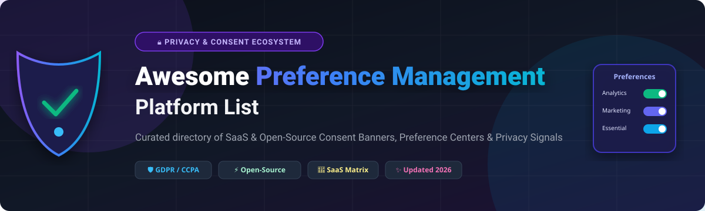
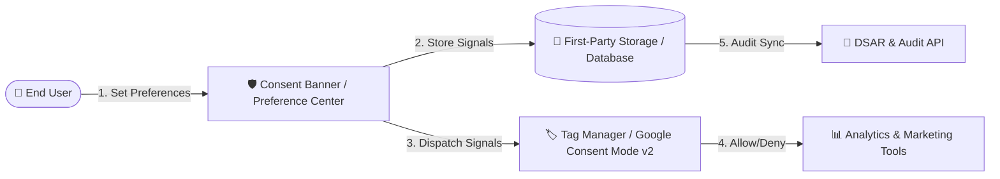

# 🛡️ Awesome Preference Management Platform

  

  
  
  
  
  
  
  

> **Curated List of Enterprise SaaS Platforms & Open-Source GitHub Projects for Preference & Consent Management**  
> *Enforcing Consent Management Platforms (CMP), Preference Centers, Cookie Compliance, Google Consent Mode v2, Privacy Signals (IAB TCF & GPP), and Data Subject Rights.*

---

## 📌 Table of Contents
- [🌟 Category Overview & Ecosystem](#-category-overview--ecosystem)
- [🏢 SaaS/Hosted Platforms](#-saashosted-platforms)
- [⚡ Open-Source GitHub Projects](#-open-source-github-projects)
- [💡 Architectural Best Practices](#-architectural-best-practices)
- [🤝 How to Contribute](#-how-to-contribute)
- [💖 Support & Sponsor](#-support--sponsor)
- [📈 Star History](#-star-history)
- [⚖️ Disclaimer](#%EF%B8%8F-disclaimer)

---

## 🌟 Category Overview & Ecosystem

**Preference Management** (and **Consent Management Platforms / CMP**) standardizes how businesses capture, store, governance, and enforce end-user privacy choices across websites, mobile apps, CRMs, and ad tech stacks. Driven by global privacy regulations (**GDPR**, **CCPA/CPRA**, **ePrivacy**, **LGPD**, **VCDPA**), modern platforms connect client-side consent banners directly to downstream marketing tools and automated Data Subject Access Request (DSAR) pipelines.

* **Key Capabilities**: Cookie banners, cross-device consent syncing, multi-channel preference centers, Google Consent Mode v2 integration, IAB TCF 2.2 / GPP signal propagation, and immutable consent audit logs.

---

## 🏢 SaaS/Hosted Platforms

> 📊 **Market Insights**: The Preference & Consent Management software market is estimated at **$1.5 Billion to $2.5 Billion** (growing at ~20% CAGR, projected to surpass $5 Billion by 2030). The market is **moderately fragmented with a single dominant leader (OneTrust)** holding significant market share, alongside well-funded mid-market enterprise contenders (*Usercentrics, TrustArc, Didomi, Transcend, Osano*). The sector is actively undergoing consolidation through strategic acquisitions (*e.g., Osano acquiring WireWheel, Didomi acquiring Sourcepoint*).

*Platforms are sorted below by **Company Size / Valuation** in descending order:*

| Product / Platform | Description | Company Size / Valuation | Starting Price | Free Tier / Trial Limits |
| :--- | :--- | :--- | :--- | :--- |
| **[OneTrust PreferenceChoice](https://www.onetrust.com/)** | Category-leading enterprise privacy suite offering multi-channel preference centers, consent banners, and automated DSAR workflows. | **~$4.5B+ Valuation** (~$500M+ ARR, $1B+ raised) | ~$10,000/year (~$833/mo) | 14-day free trial available upon demo request (No permanent free plan) |
| **[Usercentrics](https://usercentrics.com/)** | Enterprise consent management platform powering GDPR/CCPA compliance, adtech signal propagation, and marketing optimization. | **~$300M+ Valuation** (~$117M ARR / €100M+ ARR) | €7/month (~$8/mo) | Free forever (1 domain, 1,000 sessions/mo); 14-day trial for premium features |
| **[TrustArc](https://trustarc.com/)** | Comprehensive privacy governance platform offering preference management, risk assessments, and compliance automation. | **~$250M+ Valuation** (~$59.4M Revenue, acquired 2025) | ~$8,000/year (~$666/mo) | 14-day evaluated free trial upon demo request (No permanent free plan) |
| **[Didomi](https://www.didomi.io/)** | Developer-focused consent & preference center platform with advanced SDKs, multi-brand controls, and analytics. | **~$200M+ Valuation** (~$40M-$60M ARR, €72M+ raised) | ~€250/month (~$270/mo) | 14-day free trial available upon sales request (No permanent free plan) |
| **[Transcend](https://transcend.io/)** | Next-generation data privacy infrastructure automating consent enforcement, telemetry suppression, and data subject rights. | **~$200M+ Valuation** ($90M total funding raised) | ~$10,000/year (~$833/mo) | 14-day trial & demo available upon request (No permanent free plan) |
| **[Osano](https://www.osano.com/)** | Simplified data privacy platform featuring automated cookie consent, vendor risk monitoring, and subject rights handling. | **~$120M+ Valuation** ($44.4M raised, acquired WireWheel) | $199/month | Free forever (1 domain, 1 user, 5,000 visitors/mo) |
| **[Sourcepoint](https://www.sourcepoint.com/)** | Publisher-focused consent management and privacy yield platform supporting digital media and advertising ecosystems. | **~$80M+ Valuation** ($30M raised, merged with Didomi) | $500/month | 14-day free trial on demo request + free privacy scan (No permanent free plan) |
| **[Cookie Information](https://cookieinformation.com/)** | Nordic consent management platform providing verified cookie compliance, accessibility, and Google Consent Mode v2 support. | **~$300M Group Valuation** (~$8M-$12M ARR) | €15/month (~$16/mo) | 14-day free trial with full feature access (No permanent free plan) |
| **[WireWheel](https://wirewheel.io/)** | Enterprise privacy and preference management platform tailored for complex data governance and compliance programs. | **~$25M+ Valuation** ($20M raised, acquired by Osano) | ~$15,000/year (~$1,250/mo) | 14-day free trial available upon demo request (No permanent free plan) |
| **[Consentmo](https://www.consentmo.com/)** | E-commerce focused cookie compliance and consent management solution widely deployed on Shopify & online storefronts. | **~$15M+ Valuation** (~$3M-$6M ARR) | $10/month | Free forever (10,000 page views/mo); 7-day trial on paid plans |

---

## ⚡ Open-Source GitHub Projects

> 💡 **Open-Source Landscape**: While full enterprise multi-channel preference orchestration is primarily commercial, highly capable open-source tools exist for website cookie banners, client-side CMPs, and self-hosted consent loggers.

*Repositories are sorted below by **GitHub Star Count** in descending order:*

- **[cookieconsent](https://github.com/orestbida/cookieconsent)**   
  Lightweight, dependency-free GDPR cookie consent banner plugin written in vanilla JavaScript. Highly customizable with multi-language support.

- **[c15t](https://github.com/c15t/c15t)**   
  Developer-first, type-safe cookie banner and consent management library built with TypeScript.

- **[Klaro](https://github.com/KIProtect/klaro)**   
  Popular open-source consent management platform (CMP) and privacy wrapper for websites. Self-hosted, lightweight, and GDPR/ePrivacy compliant.

- **[shadcn-cookie-consent](https://github.com/r2hu1/shadcn-cookie-consent)**   
  Modern, accessible cookie consent banner component designed for Next.js applications using Tailwind CSS and `shadcn/ui`.

- **[django-cookie-consent](https://github.com/sergei-maertens/django-cookie-consent)**   
  Reusable Django application for managing cookie consent and user preferences through Django models and template tags.

- **[Orejime](https://github.com/boscop-fr/orejime)**   
  Accessible, open-source consent manager for website scripts and cookies, adhering to WCAG standards.

- **[cookie-consent-banner](https://github.com/porscheofficial/cookie-consent-banner)**   
  Lightweight Web Component and React cookie consent banner library developed by Porsche AG.

- **[ConsentStack CMP](https://github.com/ConsentStack/cmp)**   
  Open-source, developer-focused consent management platform project emphasizing human-centric privacy control.

---

## 💡 Architectural Best Practices

1. **Client-Side Signal Interception**: Block third-party scripts dynamically prior to consent confirmation.
2. **Google Consent Mode v2 Integration**: Send `ad_storage`, `analytics_storage`, `ad_user_data`, and `ad_personalization` signals to Tag Manager.
3. **Immutable Audit Trails**: Store consent state hashes timestamped for regulatory reporting.
4. **Cross-Channel Synchronization**: Propagate preference center changes across Web, Mobile SDKs, CRM, and Email engines.

---

## 🤝 How to Contribute

Contributions are warmly welcomed! To add or update an entry:
1. Fork this repository.
2. Edit `README.md` following the tabular format for SaaS platforms or star-badged format for open-source repositories.
3. Reference official sources or repository URLs.
4. Open a Pull Request on the main repository.

*For guidelines on awesome lists, visit [Awesome-Awesome-Awesome](https://github.com/ishandutta2007/Awesome-Awesome-Awesome).*

---

## 💖 Support & Sponsor

If you find this curated preference management repository useful for your privacy, legal, or engineering work, please consider supporting the project!

- ⭐ **Star** this repository to increase visibility.
- 🔀 **Fork** and share with your team and community.
- ☕ **Sponsor / Buy me a coffee**: Support ongoing open-source maintenance via [GitHub Sponsors](https://github.com/sponsors/ishandutta2007).

---

## 📈 Star History

---

## ⚖️ Disclaimer

- This repository is a **community-curated list** for informational and educational purposes only.
- Inclusion of platforms does not constitute a legal or commercial endorsement.
- Privacy compliance (GDPR, CCPA/CPRA, ePrivacy) requires legal consultation and proper configuration. The author and contributors accept no liability for compliance outcomes.

---

  <b>Built for privacy engineers, legal tech specialists, and digital marketers worldwide.</b>

